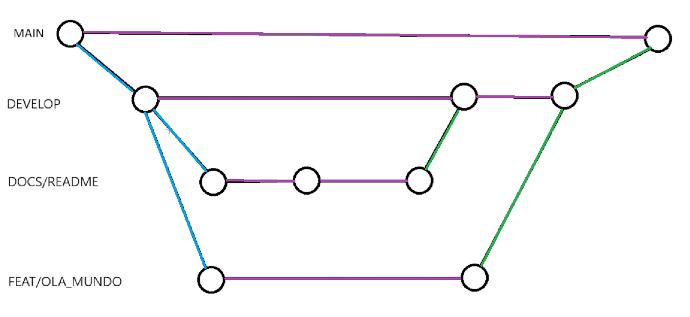

## fluxo sobre branches
A partir da `main`, é criada uma branch `develop`, que servirá como base para as próximas branches.

As próximas branches serão criadas a partir da `develop`.

Quando o trabalho de uma branch for finalizado, deverá ser realizado um merge com a `develop`.

Somente quando a `develop` estiver mais robusta, estável e sem erros ou bugs, deverá ser realizado o merge com a `main`.

A imagem abaixo busca representar esse fluxo:

* **Círculo:** representa um commit.
* **Linha azul:** representa um checkout.
* **Linha verde:** representa um merge.
* **Linha preta:** representa a transição entre commits.

## Prefixos padrões das branches
docs: apenas mudanças de documentação;
feat: uma nova funcionalidade;
fix:  correção de um bug;
perf: mudança de código focada em melhorar performance;
refactor: mudança de código que não adiciona uma funcionalidade e também não corrigi um bug;
style: mudanças no código que não afetam seu significado (espaço em branco, formatação, ponto e vírgula, etc);
test: adicionar ou corrigir testes.

## Prefixos padrões de commits
fix: correção de um bug;
feat: uma nova funcionalidade;
docs: apenas mudanças de documentação;
style mudanças no código que não afetam seu significado (espaço em branco, formatação, ponto e vírgula, etc);
refactor: mudança de código que não adiciona uma funcionalidade e também não corrigi um bug;
build: modificações em arquivos de build e dependências.
test: adicionar ou corrigir testes.
chore: tarefas repetitivas, manuteção ou infraestrutura ex: adicionar um pacote no gitignore. (Não inclui alterações em código)